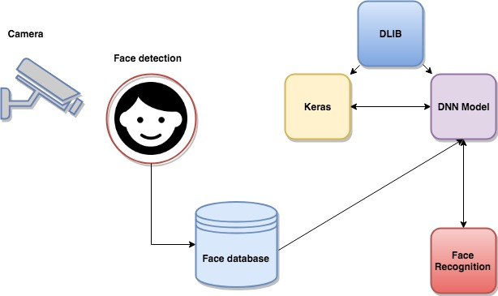

# Face Recognition with DLIB 

## Requirements (Ubuntu 16.04)


**Dlib** is a modern C++ toolkit containing machine learning algorithms and tools for creating complex software in C++ to solve real world problems. (dlib-19.4) [here](http://dlib.net/).

**Python 2.7** Python 2.7 is scheduled to be the last major version in the 2.x series before it moves into an extended maintenance period.

**Keras 2.0** Keras is a high-level neural networks API, written in Python and capable of running on top of TensorFlow, CNTK, or Theano. It was developed with a focus on enabling fast experimentation 


## Architecture




## Procedure

### Install Python 2.7

```
sudo apt-get install python-dev python-pip

```
### Install Dlib
```
pip install dlib

```
### Install Keras 2.0

```
pip install scikit-learn
pip install pillow
pip install h5py
pip install keras
```
### Record a face from a live video camera
To record a human face, run the following script:
```
$ python recording.py
```
### Train the model

To train the model run this script:
```
$ python train_nn_model.py
```
### Face recognition

To recognize a face, run the following script:

```
$ python face_recognition.py
```

